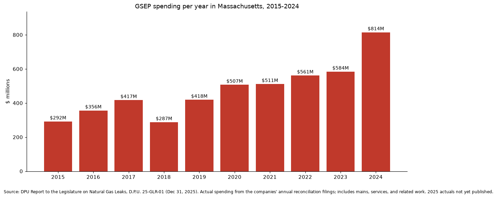
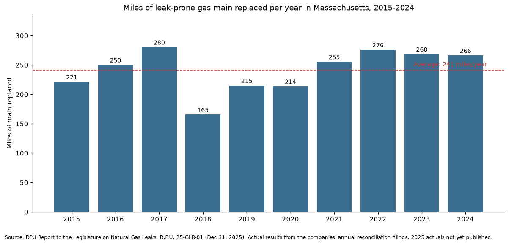
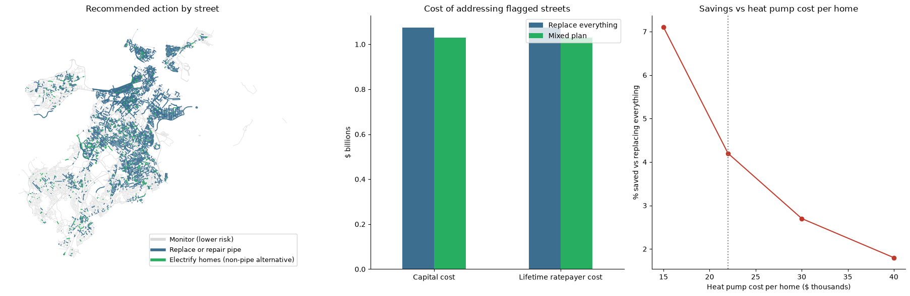
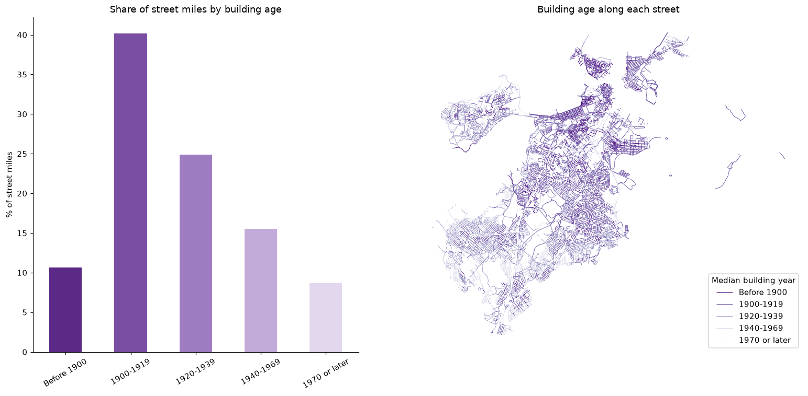
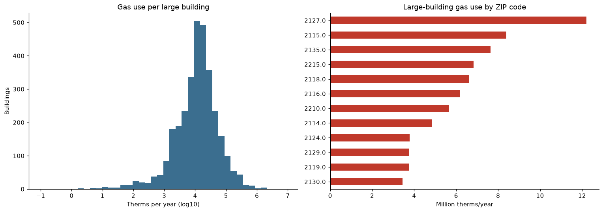
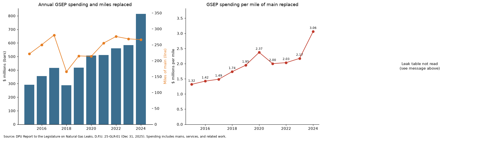
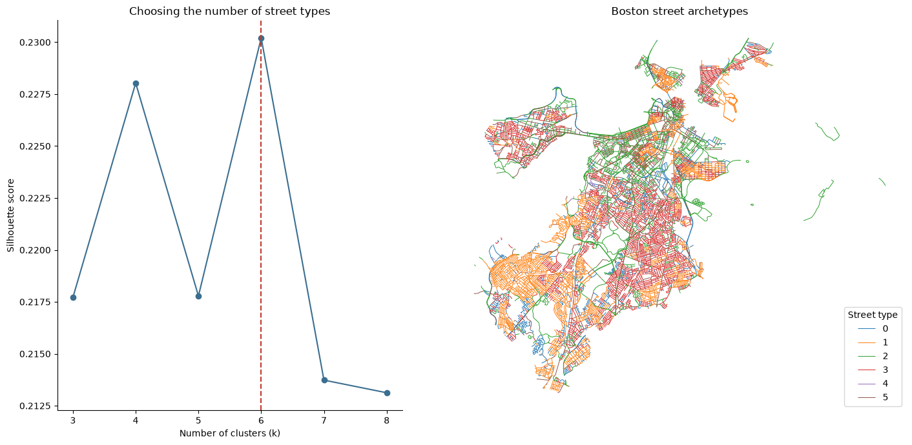

# Repair, Replace, or Retire? Boston Gas Pipe Triage

**A street-by-street analysis of Boston's leak-prone gas mains: where the old pipe likely is, and whether replacing it or electrifying the homes on each street costs less.**

Created by **Cathy Kam** · Built entirely from public data

🔗 **Live app:** [add your Streamlit link here](https://share.streamlit.io)

---

## Why this project

Underneath Boston's streets are hundreds of miles of gas mains made of cast iron and unprotected steel, much of it laid more than a century ago. These pipes are prone to leaking methane, a potent greenhouse gas, and to safety hazards.

Since 2015, Massachusetts has paid to replace them through the **Gas System Enhancement Program (GSEP)**. According to the Department of Public Utilities' (DPU) annual report to the Legislature:

- From 2015 to 2024, gas utilities spent about **$4.75 billion** to replace about **2,411 miles** of leak-prone mains, recovered through customers' gas bills.
- Spending per mile rose from **$1.32 million in 2015 to $3.06 million in 2024**, while the number of miles replaced each year stayed roughly flat.
- Open leaks across the state fell from **20,775 (2014) to 9,077 (2024)**, a 56% drop. The program worked on leaks, at a rising cost.

In 2025, DPU cut the program's spending cap and directed utilities to consider cheaper repairs and **non-pipe alternatives**, such as electrifying the homes on a street instead of laying new gas pipe. Yet of 500 alternative projects the utilities reviewed for 2026, none were judged viable.

**This project asks, for every street in Boston: is it cheaper to replace the pipe, or to switch the homes on that street to electric heat?**

| Money spent per year | Miles replaced per year |
|---|---|
|  |  |

---

## Key findings

1. **About 351 miles of Boston streets are likely on leak-prone pipe.** Replacing all of it at the latest statewide cost would take about **$1.07 billion** in capital.
2. **The tipping point is about 8.6 homes per 100 meters of street** (139 homes per mile). Below that density, buying heat pumps for every home costs less than new pipe, at about $22,000 per home.
3. **Few of Boston's oldest streets fall below it.** Only **35 of the 351 miles** (about 2,800 homes) are cheaper to electrify. Most of the oldest streets are dense triple-decker and rental neighborhoods with about 19 homes per 100 m, so a mixed plan saves only about **4%** over replacing everything.
4. **78% of the streets where electrification wins are in environmental-justice neighborhoods**, so any program there needs income-qualified support and protections for renters.
5. **Large-building gas use is highly concentrated.** Among 5,580 large buildings reporting to the city, the top 10% use **73%** of the gas, and multifamily housing is the biggest user.
6. **For dense streets, the realistic alternative to new pipe is a shared system**, such as networked geothermal, where one loop serves many homes. This matches National Grid's decision to keep its Franklin Field geothermal pilot in Dorchester, which serves multifamily public housing.



---

## How it was built

The project has four parts, one notebook each, plus the app.

### Part 1: Data extraction and cleaning

Every source is pulled programmatically and joined to **17,820 Boston street segments (about 1,030 miles)**.

| Data | Source | Used for |
|---|---|---|
| Street segments with house-number ranges | City of Boston open data (SAM) | Unit of analysis; address matching |
| FY2026 property assessment (185,000 parcels) | City of Boston open data | Building age, housing units, heat pumps |
| Building energy reports (5,580 buildings) | City of Boston BERDO | Metered natural gas use |
| Heating fuel, housing age, income, tenure | U.S. Census ACS 5-year (2024) | Neighborhood context, 681 block groups |
| Block group boundaries | U.S. Census TIGERweb | Linking Census data to streets |
| Environmental-justice block groups | MassGIS (2020) | Equity analysis |
| Daily weather since 2000 | Open-Meteo | Freeze-thaw cycles, heating degree days |
| GSEP spending, miles, leak counts | DPU report D.P.U. 25-GLR-01 | Costs, calibration, program history |

Buildings were placed on streets by matching each address to the segment whose house-number range contains it, with a **96% match rate**.

### Part 2: Exploratory analysis

- Building age along each street as a proxy for the age of the gas main underneath
- Gas heating dependence and how it relates to older housing
- Equity comparisons between environmental-justice and other neighborhoods
- Concentration of large-building gas demand
- The GSEP record: spending, miles, cost per mile, and leaks over time

| Building age along each street | Large-building gas use |
|---|---|
|  |  |



### Part 3: Modeling

- **Street segmentation (k-means clustering).** Streets were grouped into six types using building age, housing density, large-building gas use, gas heat share, renter share, income, and heat pump share. The main types: older owner-occupied neighborhoods, dense old rental neighborhoods, through streets with few homes, newer low-density streets, and large-building streets.
- **Leak-prone risk score.** Streets were ranked by building age, with the share flagged calibrated to the leak-prone share of Boston Gas's mains reported by DPU (34%). A gradient-boosting model is built in and switches on automatically when leak records are added, then is tested on a held-out year.
- **Cost-based triage.** For each flagged street, the cost of new pipe (miles × DPU's latest cost per mile) is compared with electrification (homes × heat pump cost). Streets with large buildings or no homes are not considered for electrification. Work is scheduled by risk-weighted miles per dollar within an annual budget, and the results are tested across heat pump costs from $15,000 to $40,000.



### Part 4: Interactive app

A Streamlit app where anyone can:

- Change the heat pump cost, annual budget, and whether costs are compared as capital or lifetime cost to customers
- See every street colored by its recommended action, filter by neighborhood, and hover for details
- Explore the street types and the GSEP spending record
- Download the priority list as a CSV

---

## Limitations

- **The risk score is provisional.** It is based on building age until street-level leak records are added.
- **Costs are statewide averages.** Boston's dense urban streets may cost more per mile to replace.
- **The gas network is not modeled.** Removing gas from one street can affect neighboring streets, one reason utilities have rejected alternative projects.
- **Lifetime costs cut both ways.** New pipe costs customers about $2.16 for every $1 of capital once utility returns and financing are included (DPU working group figure), while heat pumps need replacing every 15 to 20 years.
- **Two inputs are assumptions:** heat pump cost per home and the annual budget. Both can be changed in the app.

## Next steps

- Add street-level leak records to replace the provisional risk score with a trained, tested prediction model
- Model networked geothermal as a third option for dense streets
- Mark streets already replaced under GSEP, using project lists from the utilities' public filings
- Add methane avoided for each plan, using EPA emission factors by pipe material

---

## Project structure

```
boston-gas-triage/
├── app.py                          # Part 4: Streamlit app
├── requirements.txt
├── .streamlit/config.toml          # app theme
├── 01_data_extraction_cleaning.ipynb
├── 02_EDA.ipynb
├── 03_Modeling.ipynb
├── figures/                        # charts used in this README
└── data_processed/
    ├── segments_scored.geojson     # from Part 3
    ├── plan_summary.json           # from Part 3
    └── gsep_annual.csv             # from Part 2
```

## Run locally

```bash
pip install -r requirements.txt
streamlit run app.py
```

The notebooks rebuild everything from scratch: run Part 1, then Part 2, then Part 3. Raw downloads are saved to `data_raw/`, which is not included in this repository.

## Data sources

- Massachusetts DPU, *Report to the Legislature on the Prevalence of Natural Gas Leaks*, D.P.U. 25-GLR-01 (December 31, 2025)
- Massachusetts DPU, GSEP Working Group meeting minutes (October 20, 2023)
- City of Boston Open Data: Boston Street Segments (SAM), FY2026 Property Assessment, Building Emissions Reduction and Disclosure Ordinance (BERDO) reporting
- U.S. Census Bureau: American Community Survey 5-year estimates (summary file) and TIGERweb block group boundaries
- MassGIS: 2020 Environmental Justice Populations
- Open-Meteo historical weather archive

---

*Built with public data only. This is an independent portfolio project, not an official DPU or utility analysis.*
